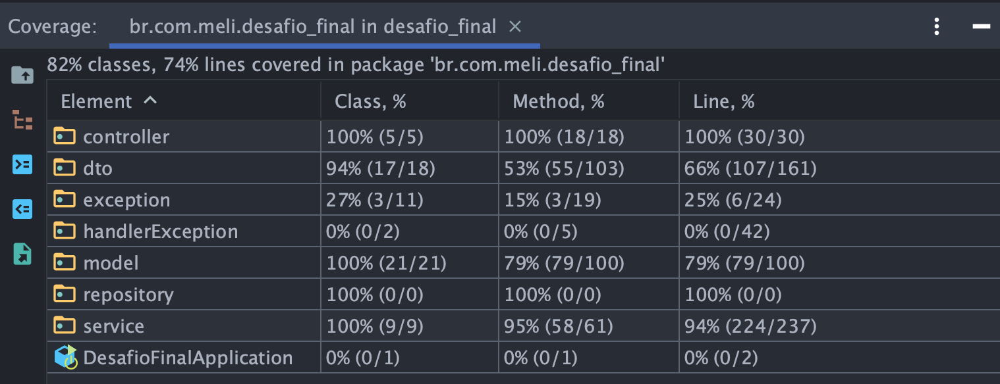
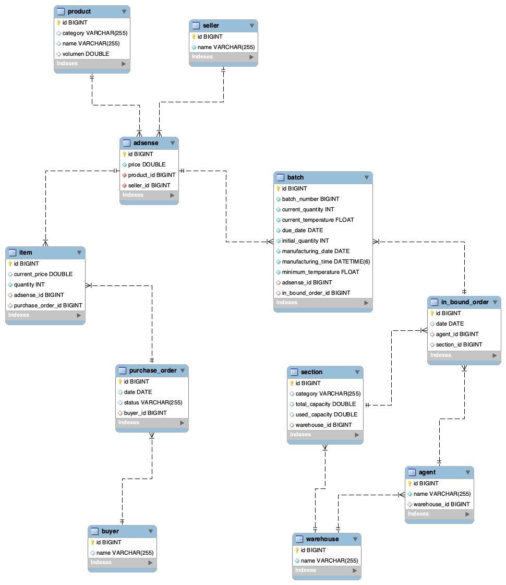

# 🥬🥦 MERCADO LIVRE - FRESCOS 🍓🍋

##### 🍍 Projeto Integrador
Projeto final para o Bootcamp de Backend Java Wave 6 do MELI.

## 🍏 Sobre:
O objetivo deste projeto final é implementar uma API REST e aplicar
os conteúdos trabalhados durante o BOOTCAMP MELI. (Git, Java, Spring, Banco de Dados,
Qualidade e Segurança).

Este projeto foi dividido em **duas fases**, contemplando a implementação de 6 requisitos obrigatórios, sendo:
   1. Desenvolvimento em **grupo**: Requisitos 1 à 5;
   2. Desenvolvimento **individual**: Requisito 6.

O projeto consiste na implementação de um serviço capaz de gerenciar a venda de produtos frescos e seu armazenamento. Para isso foram implementados os seguintes recursos:

### 🍐 FASE 1. Implementações em grupo:

- A possibilidade de Cadastrar ou Atualizar um lote de produtos por meio de um representante;
- A possibilidade de Consultar um produto;
- Listar os produtos por categoria;
- A possibilidade do comprador adicionar o produto ao carrinho;
- Mostrar os produtos no pedido;
- Modificar o status do pedido;
- Listar o produto em todos os lotes;
- Listar o produto em todos os lotes ordenados pelo lote, quantidade ou data de validade;
- Listar a quantidade total de produtos por armazém;
- Listar os lotes de um setor em um armazém ordenados pela data de vencimento;
- Listar os lotes dentro do prazo de validade solicitado que pertece a uma determinada categoria de produto, podendo ser ordenada pela quantidade de forma crescente ou decrescente.
  
Como a nossa equipe de desenvolvedoras é muito preocupada com a qualidade do nosso serviço, desenvolvemos testes unitários, garantindo que nossa aplicação funciona, além de ser escalável e segura.

### 🥥 FASE 2. Implementações individuais:

No âmbito do anúncio foram implementadas as principais funções para o gerenciamento do anúncio:

- A possibilidade de CRIAR um anúncio;
- A possibilidade de ATUALIZAR um anúncio;
- A possibilidade de PESQUISAR um anúncio específico via ID;
- A possibilidade de APAGAR um anúncio específico via ID;
- A possibilidade de LISTAR todos os anúncios.

# 📕 Requisito 06
### User Story
Implementação do CRUD para gerenciamento dos anúncios.

### Definições para os dois níveis do Requisito 6.
#### 🥑 Nível 1: Base
- ☑️ Readme descritivo.

- ☑️ Documentação em PDF com formato de User Story fornecido.

- ☑️ User Story com até 4 endpoints.

- ☑️ Coleção de casos de testes do Postman para cada endpoint.

- ☑️ Cobertura de teste entre 50% e 80%.

#### 🍉 Nível 2: Bônus
- ☑️ Todos os resultados do Nível 1 concluídos.

- ☑️ Diagrama de Entidade-Relacionamento (DER) completo do Projeto Final.

- ☑️ User Story com mais de 4 endpoints.

- ☑️ Cobertura de teste superior a 80%.

- ⬜️ Documentação por meio do Swagger.

# 🗂 Documentação
### Arquivos
* [User Story](Documentação/Requisito_6_-_User_Story.pdf)
* [DER](Documentação/Requisito_6_-_Diagrama_de_entidade_e_relacionamento.png)
* [Relatório de Cobertura de Testes](Documentação/Testes_Relatorio_de_cobertura)
* [Query para popular o banco](Documentação/Requisito_6_-_Query_Popula_Banco.sql)
* [Postman collection](Documentação/Requisito_6_-_postman_collection.json)

### API
#### 🥚 1. Retorna todos os anúncios

```http
  GET /adsense
```

#### 🌶 2. Retorna um anúncio específico com base no ID

```http
  GET /adsense/{id}
```

| Parâmetro   | Tipo       | Descrição                                   |
| :---------- | :--------- | :------------------------------------------ |
| `id`      | `Long` | **Obrigatório**. O ID do anúncio que você quer |


#### 🫐 3. Cria o registro de um novo anúncio

```http
  POST /adsense/insert
```

##### Resquest

```json
{
   "seller": {
     "id": Long
   },
   "product": {
     "id": Long
   },
  "price": Double
}
```

#### 🥭 4. Atualiza um anúncio específico com base no ID

```http
  PUT /adsense/{id}
```

| Parâmetro   | Tipo       | Descrição                                   |
| :---------- | :--------- | :------------------------------------------ |
| `id`      | `Long` | **Obrigatório**. O ID do anúncio que você quer |
| `sellerId`      | `Long` | **Obrigatório**. O ID do vendedor proprietário do anúncio |

#### Resquest
```json
{
   "product": {
     "id": Long
   },
   "price": Double
}
```

#### 🌽 5. Apaga um anúncio específico com base no ID

```http
  DELETE /adsense/{id}
```

| Parâmetro   | Tipo       | Descrição                                   |
| :---------- | :--------- | :------------------------------------------ |
| `id`      | `Long` | **Obrigatório**. O ID do anúncio que você quer |

## ✅ Rodando localmente

1. Clone o projeto

```bash
  git clone git@github.com:lecastroMELI/desafio-final.git
```

2. Abra a IDEA **IntelliJ** e no menu ```Run``` escolha ```Run...``` ```>```
   ```DesafioFinalApplication``` ```>``` ```Run```
3. Faça o download e execute no **MySQLWorkbench** o script [Requisito_6_-_Query_Popula_Banco.sql](Documentação/Requisito_6_-_Query_Popula_Banco.sql)

4. Importe a coleção [Requisito_6_-_postman_collection.json](Documentação/Requisito_6_-_postman_collection.json) para o **Postman**

5. Realize os testes manuais utilizando as rotas importadas no Postman

## 💻 Rodando os testes

Para rodar os testes, no IntelliJ, no menu ```Run``` escolha ```Run...``` ```>``` 
```br.com.meli.desafio_final``` ```>``` ```Cover```

## 📊 Relatório de Cobertura de Testes

É possível visualizar a **página principal** do relatório contendo detalhadamente a cobertura de testes gerada pelo Coverage do IntelliJ.

Para isso, em seu explorador de arquivos (como Windows Explorer ou Finder) vá até a pasta ```.../Documentação/Testes_Relatorio_de_cobertura``` e abra o arquivo **index.html** no seu ***navegador***.

A seguir a visualização da cobertura geral dos testes com destaque para camada **service** e **controller**:



# 🆔 Diagrama de Entidade-Relacionamento


## Implementações futuras / Melhorias

- Permitir o update do anúncio, apenas se não tiverem sido realizadas nenhuma venda;
- Validar que somente o vendedor proprietário do anúncio possa atualizá-lo.

# 👩🏻‍💻 < Devas /> 

Este projeto teve por base o desenvolvimento em grupo totalizando 6 requisitos obrigatórios, sendo que do 1º ao 5º foram realizadas implementações em grupo e o 6º a implementação foi individual.
#### Requisitos 1 ao 5 na branch ```main```

🍒 [@andherreraML](https://github.com/andherreraML)

🍒 [@BelAlbuquerque](https://github.com/BelAlbuquerque)

🍒 [@KarinaLimaMeli](https://github.com/KarinaLimaMeli)

🍒 [@lecastroMELI](https://github.com/lecastroMELI)

🍒 [@InajaraPereira](https://github.com/InajaraPereira)

🍒 [@sandiouriquemeli](https://github.com/sandiouriquemeli)

#### Requisito 6 na branch ```feature/requisito-06-lecastro```

🍒 [@lecastroMELI](https://github.com/lecastroMELI)