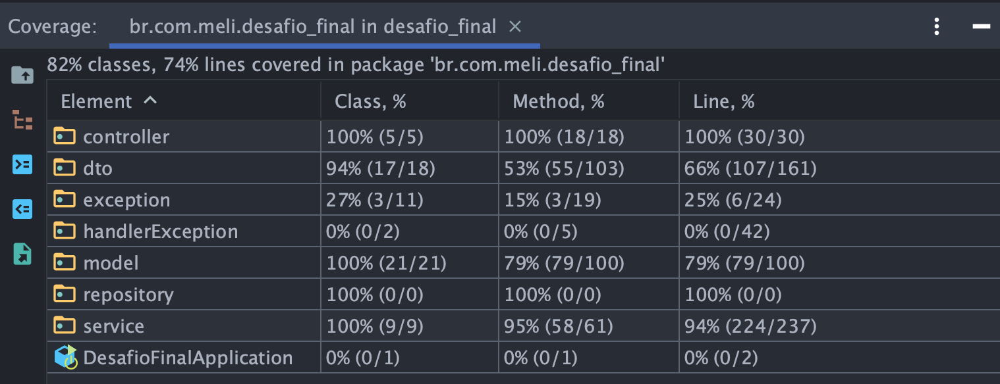

# Projeto Integrador

## Sobre:
Nesse projeto, aplicamos os conteudos que aprendemos até este momento no BootCamp de Java. Trata-se de uma aplicação desenvolvida de forma a implementar uma API REST.

#### Para isso, implementamos os seguntes recursos:

- A possibilidade de Cadastrar ou Atualizar um lote de produtos por meio de um representante;

- A possibilidade de Consultar um produto;

- Listar os produtos por categoria;

- A possibilidade do comprador adicionar o produto ao carrinho;

- Mostrar os produtos no pedido;

- Modificar o status do pedido;

- Listar o produto em todos os lotes;

- Listar o produto em todos os lotes ordenados pelo lote, quantidade ou data de validade;

- Listar a quantidade total de produtos por armazém;

- Listar os lotes de um setor em um armazém ordenados pela data de vencimento;

- Listar os lotes dentro do prazo de validade solicitado que pertece a uma determinada categoria de produto, podendo
  ser ordenada pela quantidade de forma crescente ou decrescente.

Como a nossa equipe de desenvolvedoras é muito preocupada com a qualidade do nosso serviço, desenvolvemos testes unitários, garantindo que nossa aplicação funciona, além de ser escalável e segura.

# Documentação da API

### Requisito 06
Implementação do CRUD para gerenciamento dos anúncios.

#### 1. Retorna todos os anúncios

```http
  GET /adsense
```

#### 2. Retorna um anúncio específico com base no ID

```http
  GET /adsense/{id}
```

| Parâmetro   | Tipo       | Descrição                                   |
| :---------- | :--------- | :------------------------------------------ |
| `id`      | `Long` | **Obrigatório**. O ID do anúncio que você quer |


#### 3. Cria o registro de um novo anúncio

```http
  POST /adsense/insert
```

**Resquest**

```json
{
 "seller": {
   "id": Long
 },
 "product": {
   "id": Long
 },
 "price": Double
}

```

#### 4. Atualiza um anúncio específico com base no ID

```http
  PUT /adsense/{id}
```

| Parâmetro   | Tipo       | Descrição                                   |
| :---------- | :--------- | :------------------------------------------ |
| `id`      | `Long` | **Obrigatório**. O ID do anúncio que você quer |
| `sellerId`      | `Long` | **Obrigatório**. O ID do vendedor proprietário do anúncio |

**Resquest**
```json
{
 "product": {
   "id": Long
 },
 "price": Double
}
```

#### 5. Apaga um anúncio específico com base no ID

```http
  DELETE /adsense/{id}
```

| Parâmetro   | Tipo       | Descrição                                   |
| :---------- | :--------- | :------------------------------------------ |
| `id`      | `Long` | **Obrigatório**. O ID do anúncio que você quer |

## Rodando localmente

- Clone o projeto

```bash
  git clone git@github.com:lecastroMELI/desafio-final.git
```

- Abra a IDEA IntelliJ e ```run``` o arquivo:

  src/main/java/br/com/meli/desafio_final/***DesafioFinalApplication**.java

- Faça o download e execute no MySQLWorkbench o script [Requisito_6_-_Query_Popula_Banco.sql](Requisito_6_-_Query_Popula_Banco.sql)

- Importe a coleção [Requisito_6_-_postman_collection.json](Requisito_6_-_postman_collection.json) para o Postman

- Realize os testes manuais utilizando as rotas importadas no Postman

## Rodando os testes

Para rodar os testes, no IntelliJ localize a pasta

```bash
  src/test/java/br/com/meli/desafio_final
```

Execute o comando ```run``` em
```bash
  br.com.meli.desafio_final
```

## Relatório de Cobertura de Testes

Visualize a [página principal](Testes_Relatorio_de_cobertura/index.html) do relatório contendo detalhadamente a cobertura de testes gerada pelo Coverage do IntelliJ.




# Autores 👩🏻‍💻

#### Requisitos 1 ao 5 na branch ```main```

- [@andherreraML](https://github.com/andherreraML)

- [@BelAlbuquerque](https://github.com/BelAlbuquerque)

- [@KarinaLimaMeli](https://github.com/KarinaLimaMeli)

- [@lecastroMELI](https://github.com/lecastroMELI)

- [@InajaraPereira](https://github.com/InajaraPereira)

- [@sandiouriquemeli](https://github.com/sandiouriquemeli)

#### Requisito 6 na branch ```feature/requisito-06-lecastro```

- [@lecastroMELI](https://github.com/lecastroMELI)